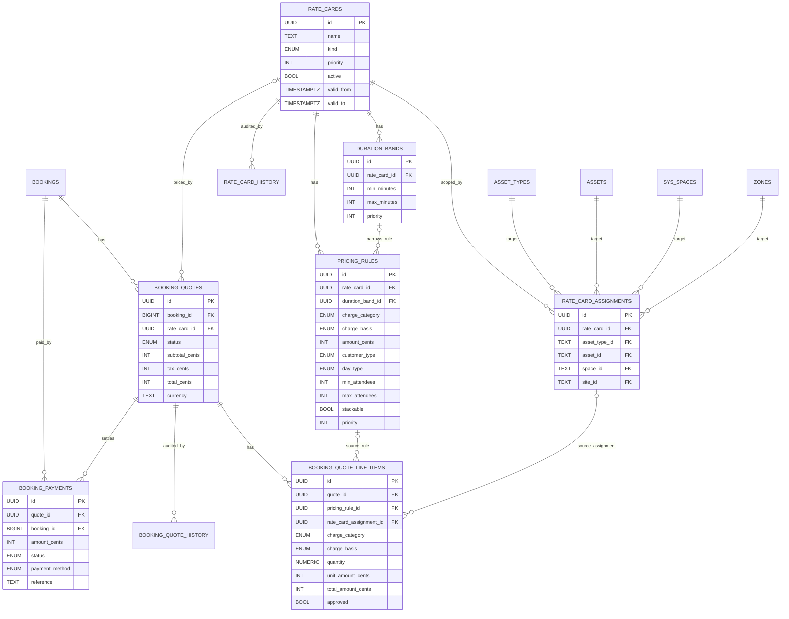
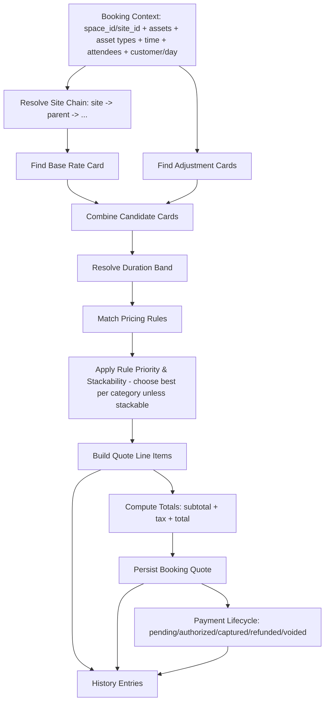

# Events Rate Card System

## Entity Relationships

```mermaid
erDiagram
    BOOKINGS ||--o{ BOOKING_QUOTES : has
    RATE_CARDS o|--o{ BOOKING_QUOTES : priced_by

    RATE_CARDS ||--o{ RATE_CARD_ASSIGNMENTS : scoped_by
    RATE_CARDS ||--o{ DURATION_BANDS : has
    RATE_CARDS ||--o{ PRICING_RULES : has

    DURATION_BANDS o|--o{ PRICING_RULES : narrows_rule

    BOOKING_QUOTES ||--o{ BOOKING_QUOTE_LINE_ITEMS : has
    PRICING_RULES o|--o{ BOOKING_QUOTE_LINE_ITEMS : source_rule
    RATE_CARD_ASSIGNMENTS o|--o{ BOOKING_QUOTE_LINE_ITEMS : source_assignment

    BOOKINGS ||--o{ BOOKING_PAYMENTS : paid_by
    BOOKING_QUOTES ||--o{ BOOKING_PAYMENTS : settles

    RATE_CARDS ||--o{ RATE_CARD_HISTORY : audited_by
    BOOKING_QUOTES ||--o{ BOOKING_QUOTE_HISTORY : audited_by

    ASSET_TYPES ||--o{ RATE_CARD_ASSIGNMENTS : target
    ASSETS ||--o{ RATE_CARD_ASSIGNMENTS : target
    SYS_SPACES ||--o{ RATE_CARD_ASSIGNMENTS : target
    ZONES ||--o{ RATE_CARD_ASSIGNMENTS : target

    RATE_CARDS {
      UUID id PK
      TEXT name
      ENUM kind
      INT priority
      BOOL active
      TIMESTAMPTZ valid_from
      TIMESTAMPTZ valid_to
    }

    RATE_CARD_ASSIGNMENTS {
      UUID id PK
      UUID rate_card_id FK
      TEXT asset_type_id FK
      TEXT asset_id FK
      TEXT space_id FK
      TEXT site_id FK
    }

    DURATION_BANDS {
      UUID id PK
      UUID rate_card_id FK
      INT min_minutes
      INT max_minutes
      INT priority
    }

    PRICING_RULES {
      UUID id PK
      UUID rate_card_id FK
      UUID duration_band_id FK
      ENUM charge_category
      ENUM charge_basis
      INT amount_cents
      ENUM customer_type
      ENUM day_type
      INT min_attendees
      INT max_attendees
      BOOL stackable
      INT priority
    }

    BOOKING_QUOTES {
      UUID id PK
      BIGINT booking_id FK
      UUID rate_card_id FK
      ENUM status
      INT subtotal_cents
      INT tax_cents
      INT total_cents
      TEXT currency
    }

    BOOKING_QUOTE_LINE_ITEMS {
      UUID id PK
      UUID quote_id FK
      UUID pricing_rule_id FK
      UUID rate_card_assignment_id FK
      ENUM charge_category
      ENUM charge_basis
      NUMERIC quantity
      INT unit_amount_cents
      INT total_amount_cents
      BOOL approved
    }

    BOOKING_PAYMENTS {
      UUID id PK
      UUID quote_id FK
      BIGINT booking_id FK
      INT amount_cents
      ENUM status
      ENUM payment_method
      TEXT reference
    }
```

## Runtime Selection Flow

```mermaid
flowchart TD
    A[Booking Context: space_id/site_id + assets + asset types + time + attendees + customer/day]
    B[Resolve Site Chain: site -> parent -> ...]
    C[Find Base Rate Card]
    D[Find Adjustment Cards]
    E[Combine Candidate Cards]
    F[Resolve Duration Band]
    G[Match Pricing Rules]
    H[Apply Rule Priority & Stackability - choose best per category unless stackable]
    I[Build Quote Line Items]
    J[Compute Totals: subtotal + tax + total]
    K[Persist Booking Quote]
    L[Payment Lifecycle: pending/authorized/captured/refunded/voided]
    M[History Entries]

    A --> B --> C
    A --> D
    C --> E
    D --> E
    E --> F --> G --> H --> I --> J --> K --> L
    I --> M
    K --> M
    L --> M
```

